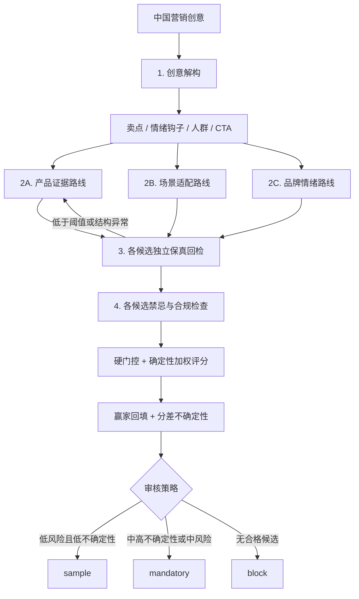

# LocalPipe — AI 创意本地化流水线

[](https://github.com/helloworld-x3/LocalPipe/actions/workflows/ci.yml)

> 输入一版中国创意，批量生成多个国家的本地版本。不是逐字翻译，而是在保留卖点和品牌规则的前提下，重新设计当地语气、文化表达与行动号召。
>
> Hello World（x³）· 2026 AI 先锋未来人才大赛 · 易点天下命题

## 30 秒了解项目

易点天下的命题不是“把广告翻译成多种语言”，而是让中国创意进入陌生市场后依然自然、真实、有共鸣。LocalPipe 将这个依赖个人经验的过程拆成一条可执行、可检查、可追溯的创译（Transcreation）工作流。

| 命题中的真实挑战 | LocalPipe 的对应方案 |
|---|---|
| 文化难跨越：同一表达可能引发共鸣，也可能造成冒犯 | 国别文化画像驱动重创作，禁忌清单与清单外风险扫描双重检查 |
| 创意供给慢：几十个市场需要上百版素材 | 多创意 × 多市场批量生成，并发执行，结构化交付 |
| 本地洞察浅：陌生市场知识依赖少数专家 | 画像条目包含 ID、来源、置信度和时效，使用情况可追溯、可校准 |
| 生成质量不可控：本地化时可能丢失卖点 | 源要素与 LLM 自检清单交叉核对，失败自动打回重做 |

当前交付的是一个**Meta + 服饰 + 法国主样板**，韩国保留为备用样板，泰国、日本、美国作为基础画像回归市场。法国画像把公开证据、冷启动假设和待母语者校准状态分层展示，不把草稿判断包装成企业真实调研。

## 为什么不是一个长 Prompt

直接让 LLM “翻译得地道一点”可以生成结果，但难以回答：用了哪些文化依据？卖点是否丢失？为什么失败？评审反馈如何沉淀？

LocalPipe 增加了三个业务闭环：

1. **质量闭环**：一次解构 → 三路线生成 → 独立保真/禁忌检查 → 硬门控与择优 → 不达标自动重做。
2. **知识闭环**：画像条目 → 产出引用 → 问题追溯 → 母语者校准。
3. **实验闭环**：裸 Prompt 对照 → A/B 严格配对 → 母语者盲测 → 评分回灌。

## 当前完成度与证据

| 能力 | 状态 | 可核对证据 |
|---|---|---|
| 四层创译管线 + 证据约束候选择优 | 已实现 | [`pipeline.py`](pipeline.py)、[`candidate_selection.py`](candidate_selection.py) |
| 泰/日/美文化画像 v0.1 | 已实现 | [`profiles/`](profiles/) |
| 品牌词与数字卖点保护 | 已实现 | [`pipeline.py`](pipeline.py)、[`examples/brand_context.json`](examples/brand_context.json) |
| A/B 裸 Prompt 对照与严格配对 | 已实现 | [`baseline.py`](baseline.py)、[`batch.py`](batch.py) |
| 异常配对剔除记录 | 已实现 | 批量运行输出 `skipped_*.json` |
| 市场洞察/创意策略卡 | **初版规则实现** | [`feishu_connector.py`](feishu_connector.py)、[`strategy.py`](strategy.py)；待企业资料校准 |
| KreadoAI Prompt/JSON适配 | **原型已实现** | [`kreado_adapter.py`](kreado_adapter.py)；待确认官方输入/接口 |
| 行为测试 | **166 项通过** | [`test_pipeline.py`](test_pipeline.py)，不调用真实 LLM；CI 在 Python 3.12 运行 |
| 泰国、日本与跨品类产出存档 | 已有样例 | [`examples/`](examples/) |
| 法国母语者 A/B 验证 | **探索性小样本已完成** | 两位独立法国法语母语消费者；已揭盲有效非平局判断 LocalPipe 9、Baseline 8；不足以证明整体优势，详见 [`docs/experiment-design.md`](docs/experiment-design.md) |
| 飞书人机协同指挥台 | **HTTP 自动化原型已联调** | 任务触发、异步执行、三候选与独立质检回写、系统推荐、审核回流、事件台账、指标快照和自动计时已验证；正式公网部署未完成 |
| 法国 Meta 服饰端到端样板 | **已生成** | [`generate_demo_meta_fr_fashion.py`](generate_demo_meta_fr_fashion.py)、[`outputs/demo_meta_fr_fashion_package.json`](outputs/demo_meta_fr_fashion_package.json)；3 个变体 + C04 风险案例 |

> 说明：自动化测试验证程序规则、异常边界和接口契约，不等于证明本地化效果优于裸 Prompt。9:8 是问题级配对判断，不是 9 人对 8 人；当前母语者样本仅用于发现缺陷和提供方向性信号，不能宣称统计显著、ROI 提升或法国市场总体偏好。

## 管线架构



三条路线都只能使用源 Brief、品牌规则和可追溯的非禁忌画像条目，不能创造新的市场事实。候选先经过高风险、低保真、结构异常、文化未对齐和错误画像引用等硬门控，再按程序重算的保真率、文化对齐、证据追溯质量、禁忌安全和路线区分度排序。第一、第二名的总分差决定不确定性与审核强度；模型自报分数不参与选择。

默认使用 `LOCALPIPE_SELECTION_MODE=competitive`。需要紧急回退时可设置为 `legacy`，恢复原单路线生成路径；`localize(source_text, market_code, brand=None, verbose=True)` 接口不变。

### `pass` 的五个条件

一次产出只有同时满足以下条件才会获得 `pass`：

1. 程序重算的**加权保真率**达到阈值（默认 70%）。保真率按要素类型加权：品牌保护词与含数字的产品事实权重最高（3），核心卖点次之（2），情绪钩子与行动号召为 1——漏掉一个数字事实比少一个情绪词严重得多。
2. 保真检查结构完整：无缺项、重复项、错误类型或非布尔 `recovered`。
3. 禁忌质检为低风险。
4. `used_entries` 非空，且引用 ID 真实有效。
5. 未把文化禁忌条目当作创作素材引用。

保真语义仍由 LLM 逐项判断，程序负责验证检查清单的完整性、类型和分数，避免信任模型自报的 `recovery_rate`。

## 一条法国服饰创意如何被重创作

主样板使用一条不涉及体重、身材或绝对化功效的中文服饰 Brief，真实调用 `localize()` 生成 3 个创意变体；每个变体都保留 `fidelity.checks`、`taboo.risk_level`、`profile_trace`、中文回译和 KreadoAI Prompt/JSON。另有 C04 身材羞辱案例用于展示 `needs_review` 分流。

法国主样板使用以下服饰 Brief：

> 换季穿搭不想反复纠结？雾川舒适针织衫，柔软针织与弹力面料让活动更自在。一件衣服从通勤到周末约会都能自然搭配。请围绕舒适、材质和真实使用场景创作，不讨论身材、体重或外貌评价。

| 市场 | 文化适配 | 质检结果 |
|---|---|---|
| 法国 | 舒适、材质、通勤到周末真实场景；避免身材羞辱和未经验证承诺 | [`outputs/demo_meta_fr_fashion_package.json`](outputs/demo_meta_fr_fashion_package.json)：3 个变体 + C04 `needs_review` |
| 韩国（备用） | 服饰 Meta 样板，保留生成脚本和回归测试 | [`generate_demo_meta_kr_fashion.py`](generate_demo_meta_kr_fashion.py) |
| 泰国 | “开黑”替换为 RoV 场景；规避“稳如老狗”的冒犯性直译；加入 COD 与当地社媒表达 | [`examples/thailand_demo.json`](examples/thailand_demo.json)：`pass` |
| 日本 | 价格锚点替换为便利店冰淇淋；使用タイパ、推し活等表达 | [`japan_demo.json`](examples/japan_demo.json)：因夸大断言与版权风险被标记为 `needs_review` |
| 泰国美妆 | 将“早八人、纯欲天花板、气场两米八”改写为当地早起、便利店与社媒语境 | [`thailand_demo_c02.json`](examples/thailand_demo_c02.json)：首轮低分后触发重做 |

这些文件是系统产出存档，用于展示管线行为。两位母语者探索性盲测已完成：FR01 出现 LocalPipe 正向信号；FR02 暴露出“针织开衫”漂移为 `chemise`、`matière fluide` 的产品类型保护失败；FR03 中两位评审都独立指出 “-5 kg” 表达不适合广告。失败样本被保留，尚未完成大样本或投放效果验证。

## 快速复现

### 1. 安装依赖

```bash
pip install -r requirements.txt
```

复制 `.env.example` 为 `.env`，配置任意 OpenAI 兼容接口：

```env
LLM_API_KEY=your-api-key
LLM_BASE_URL=https://your-provider.com
LLM_MODEL=your-model-name
LOCALPIPE_SELECTION_MODE=competitive
# 可选：三路线并行执行（默认 0=串行；置 1 单任务约 3 倍提速，速率限制仍生效）
# LOCALPIPE_PARALLEL_ROUTES=1
```

### 2. 运行

```bash
python pipeline.py
python baseline.py
python batch.py examples/creatives.json th,jp,us
```

批量模式输出四类文件：

| 文件 | 用途 |
|---|---|
| `batch_*.json` | 完整产出、质检与追溯信息 |
| `blind_*.json` | 去除组别标识后的盲测样本 |
| `key_*.json` | 评审结束后的揭盲对照表 |
| `skipped_*.json` | A/B 任一侧失败时，整对剔除的原因 |

### 3. 无 API 验证业务规则

```bash
python -m unittest discover -v
```

测试使用 `unittest.mock` 隔离 LLM，覆盖：模型虚报保真率、遗漏检查项、字符串 `"false"`、错误 `kind`、空/非法/禁忌画像引用、A/B 单边失败以及批次文件落盘。

## 实验验证方案

项目没有预设“管线一定胜出”，而是提前定义零假设与失败条件：

- 法国 Meta 服饰单市场，3 条中文广告 Brief。
- 同一模型生成裸 Prompt 与 LocalPipe 两组，严格 X/Y 盲测配对。
- 2 条主质量样本与 1 条安全案例分开统计。
- 记录本地原创感、自然程度、广告吸引力、发布可用性和问题原因。
- 若两组无明显差异，分析画像、Prompt 或规则库问题；复测仍无差异则调整路线。

当前探索性结果来自两位独立法国法语母语消费者。已纳入的有效非平局判断为 LocalPipe 9、Baseline 8，接近持平，不能据此宣称 LocalPipe 整体优于 Baseline。更重要的产出是发现了 FR02 产品类别漂移缺陷，并在 FR03 获得了两位评审对体重宣称风险方向的一致定性反馈。Q4 有不符合 A/B/C/D 约束的填写，因此不计算正式发布可用率。

完整假设、判定标准、效度威胁和执行排期见 [`docs/experiment-design.md`](docs/experiment-design.md)。

## 飞书协作闭环

LocalPipe 负责创译与质量控制，飞书负责跨市场协作和反馈沉淀：

```text
飞书多维表格任务池提交 Brief
→ 飞书自动化调用 LocalPipe HTTP 桥接
→ 3 条候选分别质检、排序并推荐 1 条
→ 结果表、候选表与飞书审核任务同步生成
→ 人工采纳、修改、风险确认与完成任务
→ 反馈自动分流为工程规则或市场画像修订候选
→ 事件台账与指标表沉淀状态、耗时和审核结果
```

飞书不是单纯的触发器或结果展示页，而是连接品牌方、创意团队、市场审核人与文化知识库的人机协同底座。当前 HTTP 自动化原型把任务状态从“待生成”推进到“生成中/待审核”，写回三候选、系统推荐、分数、排名、理由、审核策略、不确定性以及每条候选的 KreadoAI Prompt/JSON；同时建立候选明细、人工审核、规则修订、事件台账和指标表。人工在飞书完成采纳、修改、风险确认和任务关闭，反馈再进入 AI 归纳与人工批准的修订候选，生成和审核流转耗时由系统自动记录。Aily 可通过带鉴权的只读 `/query` 端点按任务 ID 查询现有状态、三候选、推荐和审核信息；该查询不会重新调用 `localize()`，也不会修改飞书记录。

当前仍需本地桥接与临时 HTTPS 隧道，不等于正式生产部署；飞书正式应用权限、稳定公网服务和企业级运维仍待完成。KreadoAI 仅生成可复制的 Prompt/JSON Brief，未接入正式 API。配置见 [`docs/feishu-automation.md`](docs/feishu-automation.md)。

## 设计边界

- **当前是文案创译 MVP**：优先解决营销创意中最依赖文化判断的上游决策层；图片、视频、配音可消费其结构化结果继续生成。
- **当前主验证一个法国样板**：Meta + 服饰 + 法国；韩国为备用，其他市场用于架构回归。法国画像仍需法语母语者校准。
- **底层 LLM 可替换**：模型决定生成能力上限；结构化流程、市场画像、证据追溯和验证机制决定产出能否稳定进入业务。
- **画像需要人工校准**：法国、韩国及其他市场的冷启动条目正式批量生产前都必须由母语者或业务审核。
- **AI + 人工终审**：禁忌质检用于筛查与分流，不替代当地法律、平台规则和品牌终审。

## 关键文件

```text
pipeline.py                 四层管线、三路线生成编排、画像加载、保真与禁忌质检
candidate_selection.py      候选硬门控、确定性评分、排序与不确定性审核策略
model.py                    OpenAI 兼容模型层、缓存、限流、遥测
batch.py                    多创意 × 多市场生成与 A/B 盲测文件
baseline.py                 裸 Prompt 对照组
test_pipeline.py            离线行为与连接器回归测试
strategy.py                 市场/平台创意策略卡规则骨架
kreado_adapter.py           KreadoAI Prompt 与结构化 JSON 适配原型
feishu_connector.py         飞书任务读取、结果回写与状态更新
feishu_automation.py        飞书自动化 HTTP 桥接、鉴权、异步调度与去重
feishu_metrics.py           飞书自动化、人工审核、效率和反馈指标汇总
quality_framework.py        MQM-inspired 质量分类与发布决策
language_assets.py          品牌名、保护术语与禁用词资产审计
creative_matrix.py          DCO-inspired 三路线创意矩阵
experiment_metrics.py       母语者盲测揭盲与小样本统计
transcreation_delivery.py   专业创译交付包与组合发布决策
profiles/                   泰国、日本、美国、韩国与法国画像；法国 v0.2 含证据分层
examples/                   品牌上下文、源文案与产出存档
docs/experiment-design.md   A/B 母语者盲测方案
docs/research-review.md     行业、竞品、开源项目与学术调研
SECURITY.md                 安全审计与能力边界
```

## 研究依据

- Unbabel（MT Summit 2025）的广告转译实验中，带文化上下文的 Prompt 在 20 条中的 17 条上优于裸 Prompt。
- Kocaman（2025）的跨文化创译研究显示，前沿 LLM 在文化共鸣维度仍存在明显不足。
- EC Innovations（2026）基准指出，企业级本地化正在从“单模型工具”转向“AI + 人工的工作流”。

完整竞品扫描、开源差异性与文献说明见 [`docs/research-review.md`](docs/research-review.md)。

## 路线图

- [x] 四层文案创译 MVP
- [x] 三路线生成、候选硬门控、确定性择优与不确定性审核
- [x] 文化画像元数据化、过期剔除与引用追溯
- [x] 品牌术语锁定与保真自动打回
- [x] A/B 严格配对、混排、揭盲和跳过记录
- [x] 泰国、日本、美国画像 v0.1；韩国备用样板；法国主样板 v0.2
- [x] 166 项离线行为与连接器回归测试
- [x] MQM-inspired 质量报告、语言资产、DCO 创意矩阵与专业创译交付包
- [x] 市场洞察与创意策略卡原型
- [x] KreadoAI Prompt/JSON适配原型
- [x] 飞书多维表格单任务 API 原型联调
- [x] 飞书自动触发 HTTP 原型联调
- [x] 飞书三候选审核、反馈分流、事件台账、指标快照与自动计时
- [x] 两位法国法语母语消费者探索性盲测并保留失败样本
- [ ] 妙搭界面和正式部署
- [ ] KreadoAI 正式 API 联调
- [ ] FR02 产品类型保护修复后的 Round 2 母语者复测
- [ ] 扩大法国母语者样本并进行企业真实业务验证
- [ ] 扩展图片、视频脚本和模型路由

## 团队

Hello World（x³）

- 乔唯一：技术与管线
- 唐启程：跨境电商业务与海外盲测渠道
