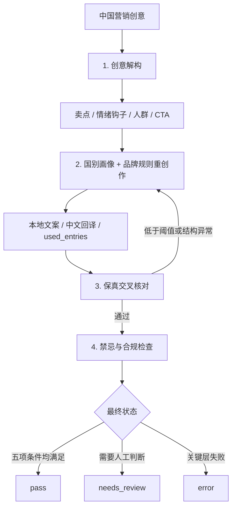

# LocalPipe — AI 创意本地化流水线

[](https://github.com/helloworld-x3/LocalPipe/actions/workflows/ci.yml)

> 输入一版中国创意，批量生成多个国家的本地版本。不是逐字翻译，而是在保留卖点和品牌规则的前提下，重新设计当地语气、文化表达与行动号召。
>
> Hello World（x³）· 2026 AI 先锋未来人才大赛 · 易点天下命题

## 30 秒了解项目

易点天下的命题不是“把广告翻译成多种语言”，而是让中国创意进入陌生市场后依然自然、真实、有共鸣。LocalPipe 将这个依赖个人经验的过程拆成一条可执行、可检查、可追溯的创译（Transcreation）工作流。

| 命题中的真实挑战 | LocalPipe 的对应方案 |
|---|---|
| 文化难跨越：同一表达可能引发共鸣，也可能造成冒犯 | 国别文化画像驱动重创作，禁忌清单与清单外风险扫描双重检查 |
| 创意供给慢：几十个市场需要上百版素材 | 多创意 × 多市场批量生成，并发执行，结构化交付 |
| 本地洞察浅：陌生市场知识依赖少数专家 | 画像条目包含 ID、来源、置信度和时效，使用情况可追溯、可校准 |
| 生成质量不可控：本地化时可能丢失卖点 | 源要素与 LLM 自检清单交叉核对，失败自动打回重做 |

当前交付的是一个**泰国、日本、美国三市场的文案创译 MVP**。它验证的是可扩展管线架构，不宣称已经覆盖几十个国家或完整图片/视频生产。

## 为什么不是一个长 Prompt

直接让 LLM “翻译得地道一点”可以生成结果，但难以回答：用了哪些文化依据？卖点是否丢失？为什么失败？评审反馈如何沉淀？

LocalPipe 增加了三个业务闭环：

1. **质量闭环**：生成 → 保真检查 → 不达标自动重做。
2. **知识闭环**：画像条目 → 产出引用 → 问题追溯 → 母语者校准。
3. **实验闭环**：裸 Prompt 对照 → A/B 严格配对 → 母语者盲测 → 评分回灌。

## 当前完成度与证据

| 能力 | 状态 | 可核对证据 |
|---|---|---|
| 四层创译管线 | 已实现 | [`pipeline.py`](pipeline.py) |
| 泰/日/美文化画像 v0.1 | 已实现 | [`profiles/`](profiles/) |
| 品牌词与数字卖点保护 | 已实现 | [`pipeline.py`](pipeline.py)、[`examples/brand_context.json`](examples/brand_context.json) |
| A/B 裸 Prompt 对照与严格配对 | 已实现 | [`baseline.py`](baseline.py)、[`batch.py`](batch.py) |
| 异常配对剔除记录 | 已实现 | 批量运行输出 `skipped_*.json` |
| 行为测试 | **32 项通过** | [`test_pipeline.py`](test_pipeline.py)，不调用真实 LLM |
| 泰国、日本与跨品类产出存档 | 已有样例 | [`examples/`](examples/) |
| 60 条母语者盲测 | 实验方案已设计，尚未执行 | [`docs/experiment-design.md`](docs/experiment-design.md) |
| 飞书多维表格协作闭环 | 入围集训阶段计划 | 见“飞书协作闭环” |

> 说明：自动化测试验证程序规则和异常边界，不等于证明本地化效果优于裸 Prompt。最终效果结论将由母语者盲测给出。

## 管线架构



### `pass` 的五个条件

一次产出只有同时满足以下条件才会获得 `pass`：

1. 程序重算的要素回收率达到阈值（默认 70%）。
2. 保真检查结构完整：无缺项、重复项、错误类型或非布尔 `recovered`。
3. 禁忌质检为低风险。
4. `used_entries` 非空，且引用 ID 真实有效。
5. 未把文化禁忌条目当作创作素材引用。

保真语义仍由 LLM 逐项判断，程序负责验证检查清单的完整性、类型和分数，避免信任模型自报的 `recovery_rate`。

## 一条创意如何被重创作

源文案包含“手机中暑、开黑、稳如老狗、一杯奶茶钱”等中国网络表达：

> 这个夏天，别让手机先中暑！CoolClip 散热背夹，3 秒降温 15 度，开黑五连坐照样稳如老狗。学生党福音，一杯奶茶钱，游戏体验直接起飞。

| 市场 | 文化适配 | 质检结果 |
|---|---|---|
| 泰国 | “开黑”替换为 RoV 场景；规避“稳如老狗”的冒犯性直译；加入 COD 与当地社媒表达 | [`thailand_demo.json`](examples/thailand_demo.json)：`pass` |
| 日本 | 价格锚点替换为便利店冰淇淋；使用タイパ、推し活等表达 | [`japan_demo.json`](examples/japan_demo.json)：因夸大断言与版权风险被标记为 `needs_review` |
| 泰国美妆 | 将“早八人、纯欲天花板、气场两米八”改写为当地早起、便利店与社媒语境 | [`thailand_demo_c02.json`](examples/thailand_demo_c02.json)：首轮低分后触发重做 |

这些文件是系统产出存档，用于展示管线行为；母语者效果验证尚未完成。

## 快速复现

### 1. 安装依赖

```bash
pip install -r requirements.txt
```

复制 `.env.example` 为 `.env`，配置任意 OpenAI 兼容接口：

```env
LLM_API_KEY=your-api-key
LLM_BASE_URL=https://your-provider.com
LLM_MODEL=your-model-name
```

### 2. 运行

```bash
python pipeline.py
python baseline.py
python batch.py examples/creatives.json th,jp,us
```

批量模式输出四类文件：

| 文件 | 用途 |
|---|---|
| `batch_*.json` | 完整产出、质检与追溯信息 |
| `blind_*.json` | 去除组别标识后的盲测样本 |
| `key_*.json` | 评审结束后的揭盲对照表 |
| `skipped_*.json` | A/B 任一侧失败时，整对剔除的原因 |

### 3. 无 API 验证业务规则

```bash
python -m unittest discover -v
```

测试使用 `unittest.mock` 隔离 LLM，覆盖：模型虚报保真率、遗漏检查项、字符串 `"false"`、错误 `kind`、空/非法/禁忌画像引用、A/B 单边失败以及批次文件落盘。

## 实验验证方案

项目没有预设“管线一定胜出”，而是提前定义零假设与失败条件：

- 10 条中文文案，覆盖 5 个品类与难/易样本。
- 泰国、日本、美国 3 个市场。
- 同一模型生成 A 组裸 Prompt 与 B 组 LocalPipe，共 60 条样本。
- 每市场邀请 5–10 位母语者进行盲测。
- 记录地道感、自然程度、购买意愿、评审渠道与文本长度。
- 若两组无明显差异，分析画像、Prompt 或规则库问题；复测仍无差异则调整路线。

完整假设、判定标准、效度威胁和执行排期见 [`docs/experiment-design.md`](docs/experiment-design.md)。

## 飞书协作闭环（入围集训计划）

LocalPipe 负责创译与质量控制，飞书负责跨市场协作和反馈沉淀：

```text
飞书多维表格任务池
→ LocalPipe 批量生成多市场版本
→ 自动创建市场审核任务
→ 母语者评分与修改意见回收
→ used_entries 定位画像问题
→ 更新画像版本
→ 看板展示进度、质量、跳过率与失败原因
```

飞书不是单纯的结果展示页，而是连接品牌方、创意团队、市场审核人与文化知识库的协作中枢。该部分属于入围集训阶段计划，当前仓库尚未将其标记为已完成。

## 设计边界

- **当前是文案创译 MVP**：优先解决营销创意中最依赖文化判断的上游决策层；图片、视频、配音可消费其结构化结果继续生成。
- **当前验证三个市场**：画像 Schema 和模型接口支持扩展，但不把三国原型包装成全球覆盖。
- **画像需要人工校准**：日美画像属于冷启动版本，正式批量生产前必须由母语者审核。
- **AI + 人工终审**：禁忌质检用于筛查与分流，不替代当地法律、平台规则和品牌终审。

## 关键文件

```text
pipeline.py                 四层管线、画像加载、保真与禁忌质检
model.py                    OpenAI 兼容模型层、缓存、限流、遥测
batch.py                    多创意 × 多市场生成与 A/B 盲测文件
baseline.py                 裸 Prompt 对照组
test_pipeline.py            32 项离线行为测试
profiles/                   泰国、日本、美国文化画像 v0.1
examples/                   品牌上下文、源文案与产出存档
docs/experiment-design.md   A/B 母语者盲测方案
docs/research-review.md     行业、竞品、开源项目与学术调研
SECURITY.md                 安全审计与能力边界
```

## 研究依据

- Unbabel（MT Summit 2025）的广告转译实验中，带文化上下文的 Prompt 在 20 条中的 17 条上优于裸 Prompt。
- Kocaman（2025）的跨文化创译研究显示，前沿 LLM 在文化共鸣维度仍存在明显不足。
- EC Innovations（2026）基准指出，企业级本地化正在从“单模型工具”转向“AI + 人工的工作流”。

完整竞品扫描、开源差异性与文献说明见 [`docs/research-review.md`](docs/research-review.md)。

## 路线图

- [x] 四层文案创译 MVP
- [x] 文化画像元数据化、过期剔除与引用追溯
- [x] 品牌术语锁定与保真自动打回
- [x] A/B 严格配对、混排、揭盲和跳过记录
- [x] 泰国、日本、美国画像 v0.1
- [x] 32 项离线行为测试
- [ ] 入围后接入飞书多维表格协作闭环
- [ ] 执行 60 条母语者盲测并回灌评分
- [ ] 基于母语者反馈校准画像与规则库
- [ ] 扩展图片、视频脚本和模型路由

## 团队

Hello World（x³）

- 乔唯一：技术与管线
- 唐启程：跨境电商业务与海外盲测渠道
- 孙文洁：文化画像与评分标准
